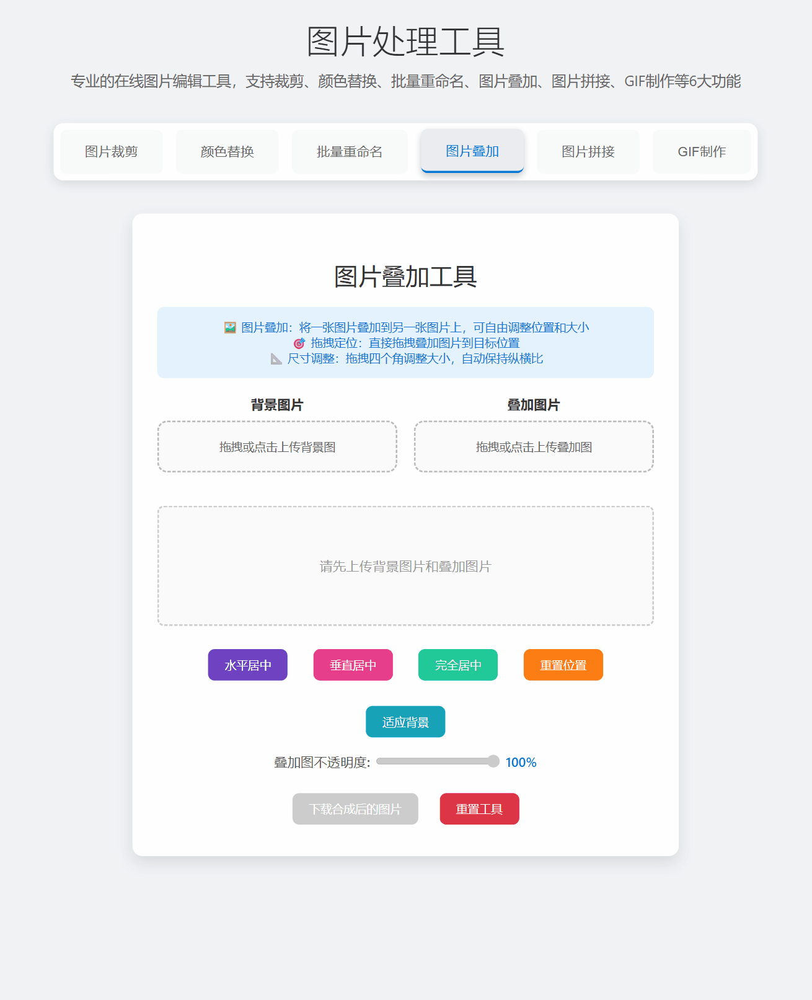

# 图片处理工具

一个功能强大的在线图片处理工具，提供专业的图片编辑功能，支持裁剪、颜色替换、批量重命名、图片叠加、图片拼接、GIF制作等6大功能。所有功能均在浏览器本地完成，无需上传到服务器，保护您的隐私。



## 🚀 快速开始

只需在浏览器中打开 `index.html` 文件即可使用！

1. 下载或克隆本项目
2. 双击打开 `index.html` 文件
3. 选择需要的功能标签页
4. 上传图片开始处理
5. 下载处理后的结果

**无需安装任何软件，无需配置环境，开箱即用！**

## 📋 功能概览

| 功能 | 说明 | 适用场景 |
|------|------|----------|
| 🖼️ **图片裁剪** | 精确裁剪图片，支持预设管理 | Logo裁剪、头像制作、区域提取 |
| 🎨 **颜色替换** | 批量替换图片中的颜色 | 换色、去水印、颜色统一 |
| 🔄 **批量重命名** | 快速修改图片文件后缀 | 批量改扩展名、统一命名 |
| 🖼️ **图片叠加** | 将图片叠加到另一张图片上 | 添加水印、logo、边框 |
| 📐 **图片拼接** | 多张图片拼接成一张 | 全景图、长截图、九宫格 |
| 🎬 **GIF制作** | 多张图片合成GIF动画 | 表情包、动画演示、幻灯片 |

## ✨ 功能特性

### 🖼️ 图片裁剪工具
- **精确裁剪**：支持手动输入坐标和尺寸进行精确裁剪
- **可视化操作**：集成 Cropper.js，提供直观的拖拽裁剪体验
- **实时预览**：裁剪参数实时更新，所见即所得
- **预设管理**：
  - 内置2个常用预设值（55,0,341,65 和 65,0,411,65）
  - 支持保存自定义预设，可命名管理
  - 预设数据保存在浏览器本地，下次使用自动加载
  - 支持批量删除预设
- **高质量输出**：保持原图质量，支持 PNG 格式下载
- **拖拽上传**：支持拖拽文件上传，操作便捷

### 🎨 颜色替换工具
- **批量处理**：支持同时上传多张图片进行批量颜色替换
- **实时预览**：颜色参数调整时，所有图片实时显示替换效果
- **网格显示**：图片以网格形式展示，所有效果一目了然
- **智能容差**：可调节颜色匹配容差（0-441），精确控制替换范围
- **多格式支持**：支持十六进制（#ff0000）、命名颜色（red）、RGB（rgb(255,0,0)）等多种颜色格式
- **颜色预览**：提供颜色圆圈预览，直观显示原色和目标色
- **状态指示**：
  - 蓝色边框标识当前选中图片
  - 绿色圆点表示已处理完成
  - 黄色圆点表示处理中
- **批量下载**：支持单张下载或一键批量下载所有处理后的图片
- **文件计数**：显示已上传文件总数

### 🔄 批量重命名工具
- **批量重命名**：支持同时上传多张图片快速修改文件后缀名
- **多后缀支持**：预设常用图片格式后缀
  - .png - PNG格式后缀
  - .jpg / .jpeg - JPG格式后缀
  - .webp - WEBP格式后缀
  - .avif - AVIF格式后缀
- **压缩包下载**：可将所有重命名后的文件打包成ZIP一键下载
  - .bmp - BMP格式后缀
  - .gif - GIF格式后缀
- **即时预览**：上传后立即显示重命名效果，切换后缀实时更新
- **列表展示**：
  - 显示缩略图预览
  - 清晰对比原文件名和新文件名
  - 箭头指示重命名方向
- **简单快速**：
  - 仅修改文件名后缀，不进行实际格式转换
  - 保留原文件内容，速度极快
  - 保留原文件名主体部分
- **批量下载**：一键下载所有重命名后的图片
- **拖拽上传**：支持拖拽文件上传，操作便捷
- **注意事项**：此功能仅更改文件扩展名，不会转换实际图片格式

### 🖼️ 图片叠加工具
- **图片合成**：将一张图片叠加到另一张图片上，创建合成效果
- **可视化编辑**：
  - 在canvas上实时预览叠加效果
  - 蓝色边框和控制点标识叠加图片
- **拖拽定位**：
  - 直接拖拽叠加图片移动位置
  - 自动限制在画布范围内
  - 鼠标悬停显示拖动光标
- **尺寸调整**：
  - 拖拽四个角的控制点调整大小
  - 自动保持纵横比，避免变形
  - 支持任意方向缩放
- **智能对齐**：
  - 水平居中：叠加图片水平居中对齐
  - 垂直居中：叠加图片垂直居中对齐
  - 完全居中：叠加图片水平垂直都居中
  - 重置位置：恢复到初始状态（居中，50%大小）
  - 适应背景：叠加图片自动缩放至适应背景大小
- **不透明度调整**：滑块控制叠加图片的透明度（0-100%）
- **高质量输出**：下载不包含边框和控制点的纯净合成图片
- **拖拽上传**：背景图和叠加图都支持拖拽上传

### 🎬 GIF动画制作工具
- **多图转GIF**：将多张静态图片合成为GIF动画
- **帧序列管理**：
  - 拖拽调整帧的播放顺序
  - 序号标识显示帧序
  - 支持删除单帧
- **参数控制**：
  - 帧延迟：调整每帧显示时长（50-5000ms）
  - 图片质量：调整GIF质量（1-30，值越小质量越高）
  - 循环播放：可选择无限循环或播放一次
- **快速预设**：
  - 极快(100ms)：快速动画效果
  - 快速(200ms)：较快动画
  - 正常(500ms)：标准速度（默认）
  - 慢速(1s)：慢动画效果
  - 很慢(2s)：超慢展示
- **实时预览**：
  - 生成后立即预览GIF效果
  - 可调整参数重新生成
- **进度显示**：
  - 实时显示生成进度
  - 百分比进度条
  - 帧添加状态提示
- **智能处理**：
  - 自动统一所有帧的尺寸（取最大宽高）
  - 小图片自动居中对齐
- **批量处理**：支持一次上传多张图片
- **高质量输出**：导出标准GIF格式动画
- **拖拽上传**：支持拖拽文件上传

### 📐 图片拼接工具
- **多图拼接**：将多张图片拼接成一张完整图片
- **多种拼接模式**：
  - 水平拼接：所有图片横向排列成一行
  - 垂直拼接：所有图片纵向排列成一列
  - 一行2个：每行显示2张图片，自动换行
  - 一行3个：每行显示3张图片，自动换行（默认）
  - 一行4个：每行显示4张图片，自动换行
  - 一行5个：每行显示5张图片，自动换行
- **智能布局**：
  - 最后一行不满时自动居中显示
  - 例如：一行3个模式，上传5张图片，显示为2行，最后一行只有2张居中
- **实时预览**：
  - 上传图片后自动显示拼接效果
  - 切换模式、调整参数、拖拽排序时自动更新预览
  - 无需点击预览按钮，所见即所得
- **拖拽排序**：
  - 拖拽图片缩略图调整拼接顺序
  - 序号标识显示当前排序
  - 支持删除单张图片
- **参数调整**：
  - 图片间距：设置图片之间的空白间距（0-100px）
  - 背景颜色：选择拼接画布的背景色
- **智能对齐**：
  - 水平拼接时图片垂直居中对齐
  - 垂直拼接时图片水平居中对齐
  - 网格布局时图片在单元格中居中
  - 最后一行不满时整行居中对齐
- **批量处理**：支持一次上传多张图片
- **高质量输出**：导出PNG格式的拼接图片
- **拖拽上传**：支持拖拽文件上传

## 🚀 使用方法

所有工具都遵循相同的基本流程：**上传图片 → 调整参数 → 实时预览 → 下载结果**

### 图片裁剪
1. 点击"图片裁剪"标签页
2. 拖拽或点击上传需要裁剪的图片
3. 使用可视化裁剪框调整裁剪区域，或：
   - 手动输入坐标参数（X、Y、W、H）
   - 点击预设按钮快速应用常用参数
   - 保存当前参数为自定义预设供以后使用
4. 点击"应用裁剪"确认裁剪区域
5. 点击"下载裁剪后的图片"保存结果

#### 预设管理
- **使用固定预设**：直接点击"预设1"或"预设2"按钮
- **保存自定义预设**：
  1. 调整好裁剪参数
  2. 点击"保存当前值为预设"
  3. 输入预设名称（如"Logo区域"、"头像裁剪"等）
  4. 确认保存，橙色预设按钮会立即出现
- **管理预设**：
  1. 点击"管理预设"按钮
  2. 查看所有自定义预设列表
  3. 输入要删除的预设编号（多个用逗号分隔，如：1,3,5）
  4. 确认删除

### 颜色替换
1. 点击"颜色替换"标签页
2. 拖拽或点击上传图片（支持多选）
3. 上传后所有图片以网格形式显示
4. 设置颜色参数：
   - **原颜色**：要被替换的颜色，支持多种格式：
     - 十六进制：`#000000`、`#000`
     - 命名颜色：`black`、`red`、`blue`、`white`、`green` 等
     - RGB格式：`rgb(0,0,0)`、`rgba(0,0,0,1)`
   - **目标颜色**：替换后的颜色（支持相同格式）
   - **容差**：颜色匹配范围，值越大匹配范围越广（推荐30-100）
5. 调整参数时，所有图片实时显示替换效果
6. 点击任意图片可以标记为当前选中（蓝色边框）
7. 下载选项：
   - 点击"下载修改后的图片"下载当前选中图片
   - 点击"下载所有图片"批量下载所有处理后的图片

### 批量重命名
1. 点击"批量重命名"标签页
2. 拖拽或点击上传图片（支持多选）
3. 上传后图片会自动以列表形式显示，包含：
   - 缩略图预览
   - 原文件名
   - 箭头指示
   - 新文件名（根据目标后缀自动生成）
4. 选择目标后缀：
   - 点击彩色后缀按钮（.png、.jpg、.jpeg、.webp、.avif、.bmp、.gif）快速选择
   - 或使用下拉菜单选择目标后缀
5. 文件名会实时更新显示重命名效果
6. 点击"下载所有重命名后的图片"批量下载
7. 点击"下载压缩包"可一次性获取ZIP文件（包含所有重命名后的图片）

#### 重要说明
- ⚠️ **此功能仅修改文件扩展名**，不会对图片内容进行任何转换
- 如果需要实际转换图片格式，请使用专业的图片格式转换工具
- 下载的文件内容与原文件完全相同，只是文件名后缀不同
- 适用场景：批量修改文件扩展名以满足特定命名要求

### 图片叠加
1. 点击"图片叠加"标签页
2. 上传图片：
   - 左侧：上传背景图片（底层图片）
   - 右侧：上传叠加图片（要叠加在背景上的图片）
3. 两张图片都上传后，会在canvas上显示叠加效果：
   - 背景图片作为底层
   - 叠加图片默认居中显示，缩放到背景的50%大小
   - 蓝色边框和四个角的控制点标识叠加图片
4. 调整位置：
   - 在叠加图片上按住鼠标左键拖拽移动位置
   - 图片会自动限制在画布范围内
5. 调整大小：
   - 拖拽四个角的任意一个控制点
   - 自动保持纵横比，不会变形
   - 可以放大或缩小
6. 使用对齐按钮：
   - **水平居中**：叠加图片水平居中
   - **垂直居中**：叠加图片垂直居中
   - **完全居中**：同时水平和垂直居中
   - **重置位置**：恢复到初始状态
   - **适应背景**：叠加图片缩放到适应背景大小
7. 调整不透明度（可选）：
   - 拖动不透明度滑块调整叠加图片的透明度
   - 100%为完全不透明，0%为完全透明
8. 点击"下载合成后的图片"保存结果

#### 使用技巧
- **水印添加**：上传logo作为叠加图片，调整到合适位置和大小，设置适当的不透明度
- **图片拼接**：将小图叠加到大图的特定位置
- **边框效果**：使用带透明区域的PNG作为叠加图片创建边框效果
- **保持纵横比**：所有缩放操作自动保持纵横比，确保图片不变形

### 图片拼接
1. 点击"图片拼接"标签页
2. 拖拽或点击上传多张图片（支持多选）
3. 上传后会自动显示拼接预览，同时显示图片列表：
   - 左上角显示序号（1、2、3...）
   - 右上角有删除按钮（×）
   - 拖拽图片可调整排列顺序
4. 选择拼接模式：
   - 点击彩色模式按钮快速选择
   - 或使用下拉菜单选择模式
   - **水平拼接**：所有图片横向排列成一行
   - **垂直拼接**：所有图片纵向排列成一列
   - **一行N个**：图片按每行N个排列，自动换行，最后一行不满时居中
5. 调整参数（可选）：
   - **图片间距**：设置图片之间的空白间距
   - **背景颜色**：选择间隙和空白区域的颜色
6. 调整参数、切换模式、拖拽排序后会自动实时更新预览
7. 点击"下载拼接图片"保存结果

### GIF制作
1. 点击"GIF制作"标签页
2. 拖拽或点击上传多张图片（支持多选）
3. 上传后会显示帧列表：
   - 左上角显示帧序号（1、2、3...）
   - 右上角有删除按钮（×）
   - 拖拽图片可调整播放顺序
4. 调整参数：
   - **帧延迟**：每帧显示时长（毫秒），值越大播放越慢
   - **图片质量**：1-30，值越小质量越高，文件也越大
   - **无限循环**：勾选后GIF会循环播放
5. 点击彩色延迟按钮可快速设置常用速度
6. 点击"生成GIF"开始制作
7. 生成过程中会显示进度条和当前状态
8. 生成完成后会自动显示GIF预览
9. 点击"下载GIF"保存动画

#### 使用技巧
- **表情包制作**：上传几张表情图，设置快速播放（100-200ms）
- **动画演示**：设置正常速度（500ms），适合教程演示
- **慢动作展示**：设置慢速（1-2s），适合作品展示
- **帧序调整**：拖拽帧缩略图可调整动画播放顺序
- **质量优化**：
  - 质量10：平衡质量和文件大小（推荐）
  - 质量1-5：高质量，文件较大
  - 质量15-30：低质量，文件较小
- **循环设置**：取消勾选"无限循环"可让GIF只播放一次

### 图片拼接
#### 使用技巧
- **全景拼接**：使用水平拼接模式制作全景图，所有图片横向排列
- **长截图**：使用垂直拼接模式拼接多个截图
- **九宫格相册**：
  - 使用"一行3个"模式
  - 上传9张图片自动排列成3x3网格
  - 上传8张图片会显示3行，最后一行2张居中
- **照片墙**：
  - 使用"一行4个"或"一行5个"模式
  - 适合展示大量照片
  - 最后一行自动居中，视觉平衡
- **拼接顺序**：拖拽图片缩略图可轻松调整顺序
- **删除多余图片**：点击图片右上角的×可删除不需要的图片
- **间距设置**：设置小间距（5-10px）可让图片看起来更整洁
- **背景颜色**：选择白色或透明背景，根据使用场景调整

## 🛠️ 技术栈

- **前端框架**：原生 HTML5 + CSS3 + JavaScript
- **图片处理**：Canvas API
  - 图片裁剪与绘制
  - 像素级颜色处理
  - 图片叠加与合成
  - 多图拼接与排列
  - 不透明度控制
- **裁剪功能**：Cropper.js
- **GIF生成**：gif.js（GIF动画编码库）
- **文件操作**：Blob API、File API、FileReader（文件读取与下载）
- **数据存储**：localStorage（本地存储预设数据）
- **交互设计**：鼠标事件（拖拽、缩放、排序）
- **UI设计**：现代化响应式设计
- **浏览器兼容**：支持现代浏览器（Chrome、Firefox、Edge、Safari）

## 📁 项目结构

```
├── index.html          # 主页面文件（包含所有HTML、CSS、JavaScript）
├── README.md           # 项目说明文档
└── .gitignore          # Git忽略文件配置
```

## 🎯 核心亮点

✨ **6大功能模块**：裁剪、替换、重命名、叠加、拼接、GIF - 满足各种图片处理需求
🔒 **完全本地化**：所有处理在浏览器完成，图片不上传服务器，隐私安全
⚡ **即开即用**：无需安装，无需配置，打开网页即可使用
🎨 **实时预览**：所有操作即时反馈，所见即所得
🔄 **批量处理**：支持批量操作，大幅提高工作效率
📱 **响应式设计**：适配各种屏幕尺寸，PC和移动端都可用
🎮 **拖拽交互**：支持拖拽上传、拖拽排序、拖拽调整，操作直观
💾 **本地存储**：预设数据自动保存，下次打开自动加载

## 🎯 特色功能

### 界面设计
- **标签页布局**：6个功能清晰分类，避免界面混乱，易于扩展
- **响应式设计**：适配不同屏幕尺寸，支持移动端访问
- **现代化UI**：简洁美观的界面设计，流畅的动画效果
- **彩色按钮**：功能按钮使用不同颜色，快速识别

### 用户体验
- **拖拽上传**：所有工具都支持拖拽文件上传，提升用户体验
- **实时预览**：所有操作都有实时反馈，所见即所得
- **批量处理**：颜色替换、批量重命名、图片拼接、GIF制作支持批量操作，大幅提高工作效率
- **一键重置**：每个工具都有独立的重置按钮，无需刷新页面即可重新开始
- **静默操作**：无弹窗提示，下载和重置操作流畅无打扰
- **防抖优化**：颜色调整时使用防抖技术，避免频繁计算影响性能
- **快速响应**：批量重命名功能仅修改文件名，速度极快
- **可视化编辑**：图片叠加和拼接工具提供直观的拖拽和缩放操作
- **智能约束**：自动保持纵横比、限制边界、最后一行居中，避免误操作
- **拖拽排序**：图片拼接和GIF制作支持拖拽调整顺序，操作直观便捷
- **进度反馈**：GIF生成时显示实时进度条，了解处理状态

### 数据管理
- **本地存储**：裁剪预设数据保存在浏览器localStorage
- **持久化**：关闭浏览器后数据不丢失，下次打开自动加载
- **隐私保护**：所有图片处理在本地完成，不上传服务器

## 🔧 默认配置

### 裁剪工具内置预设
- **预设1**：X=55, Y=0, W=341, H=65
- **预设2**：X=65, Y=0, W=411, H=65

### 颜色替换默认参数
- **原颜色**：#000000（黑色）
- **目标颜色**：#ff0000（红色）
- **容差**：999（最大容差，可根据需要调整）

## 🔧 通用操作

每个工具都包含以下通用操作：

1. **上传图片**：
   - 点击上传区域选择文件
   - 或直接拖拽文件到上传区域
   - 支持单选或多选（根据功能需求）

2. **调整参数**：
   - 使用滑块、输入框、下拉菜单等控件
   - 点击彩色按钮快速应用预设
   - 实时预览参数变化效果

3. **下载结果**：
   - 点击下载按钮保存处理后的图片
   - 无弹窗确认，直接下载
   - 支持单张或批量下载

4. **重置工具**：
   - 点击红色"重置工具"按钮
   - 清空所有数据和设置
   - 无需刷新页面即可重新开始

## 💡 使用技巧

### 裁剪工具
1. **精确裁剪**：需要精确尺寸时，直接输入数值比拖拽更准确
2. **预设复用**：对于经常使用的裁剪尺寸，保存为预设可以大幅提高效率
3. **预设命名**：使用有意义的名称（如"微信头像"、"公众号封面"）方便识别

### 颜色替换
1. **容差调整**：
   - 小容差（10-30）：精确替换特定颜色
   - 中容差（50-100）：替换相近颜色
   - 大容差（200+）：替换大范围颜色
2. **颜色输入技巧**：
   - 使用十六进制快速输入常见颜色：`#000000`（黑）、`#ffffff`（白）、`#ff0000`（红）
   - 使用命名颜色更直观：`black`、`white`、`red`、`blue`、`green`、`yellow`
   - 使用RGB格式精确控制：`rgb(255,0,0)`
3. **批量处理**：先用一张图片调试好参数，再批量上传所有图片
4. **实时预览**：调整参数时注意观察预览效果，找到最佳容差值

### 批量重命名
1. **使用场景**：
   - 批量修改图片扩展名以符合特定系统要求
   - 统一文件命名规范（如将所有.jpeg改为.jpg）
   - 快速修改大量文件的后缀名
2. **注意事项**：
   - ⚠️ **仅更改文件名后缀，不转换实际格式**
   - 修改后缀不会改变文件的真实格式（如.png改成.jpg，文件仍是PNG格式）
   - 某些软件可能无法正确识别后缀与实际格式不符的文件
   - 建议仅在明确需求下使用此功能
3. **最佳实践**：
   - 在修改后缀前确保了解文件的真实格式
   - 如需真正转换格式，使用专业的格式转换工具
   - 批量重命名前建议备份原文件
4. **快速操作**：
   - 点击彩色按钮快速切换不同后缀
   - 列表实时显示重命名效果
   - 一次可处理大量文件

### 图片拼接
1. **全景拼接技巧**：
   - 使用水平拼接模式
   - 间距设为0实现无缝拼接
   - 选择合适的背景色（通常为白色或黑色）
2. **长图制作**：
   - 使用垂直拼接模式
   - 适合拼接聊天记录、文章截图等
   - 可添加小间距增加层次感
3. **九宫格/照片墙制作**：
   - 使用"一行3个"模式制作九宫格（上传9张）
   - 使用"一行4个"模式制作相册墙
   - 最后一行不满时自动居中，美观整齐
   - 设置统一间距更美观
4. **灵活布局示例**：
   - 5张图片 + 一行2个 = 3行（2-2-1居中）
   - 7张图片 + 一行3个 = 3行（3-3-1居中）
   - 10张图片 + 一行4个 = 3行（4-4-2居中）
5. **顺序调整**：
   - 直接拖拽图片缩略图
   - 拖到目标位置即可交换顺序
   - 左上角序号显示当前排序
6. **图片管理**：
   - 点击右上角×删除不需要的图片
   - 可以多次上传，累加图片
   - 重置按钮一键清空所有图片

### 图片叠加
1. **水印制作**：
   - 上传logo或文字图片作为叠加图
   - 调整到合适的大小（通常是背景的10-20%）
   - 移动到右下角或其他合适位置
   - 设置50-80%的不透明度，既可见又不影响主图
2. **拼图合成**：
   - 使用"适应背景"让叠加图填满背景
   - 使用"完全居中"快速居中对齐
   - 结合不透明度创建混合效果
3. **位置调整技巧**：
   - 使用对齐按钮快速定位
   - 拖拽时可精确控制像素级位置
   - 图片自动限制在画布内，不会超出边界
4. **尺寸控制**：
   - 拖拽任意角进行缩放，自动保持纵横比
   - "重置位置"恢复到初始50%大小
   - "适应背景"自动计算最佳缩放比例
5. **透明度应用**：
   - 100%：完全不透明，适合logo等
   - 50-80%：半透明，适合水印
   - 20-50%：淡淡的背景效果
   - 0%：完全透明（可用于预览位置）

## 📝 更新日志

### v3.2.0（当前版本）
- ✨ 新增图片拼接工具
  - 支持水平拼接、垂直拼接
  - 支持"一行N个"灵活网格布局（一行2/3/4/5个）
  - 智能居中：最后一行图片不满时自动居中显示
  - 拖拽调整图片排列顺序
  - 序号标识显示当前顺序
  - 可删除单张图片
  - 调整图片间距（0-100px）
  - 自定义背景颜色
  - 上传即预览，无需手动点击预览按钮
  - 切换模式、调整参数、拖拽排序时自动实时更新预览
  - 智能对齐（水平、垂直、单元格居中）
  - 导出高质量PNG图片
- 🎨 优化交互体验
  - 图片拼接工具实现真正的实时预览
  - 所有操作即时反馈，所见即所得
  - 灵活的网格布局系统，适应任意数量图片
- 📚 完善文档，添加图片拼接使用教程和技巧

### v3.1.0
- ✨ 新增图片叠加工具
  - 支持将一张图片叠加到另一张图片上
  - 可视化canvas编辑，实时预览叠加效果
  - 上传背景图后立即显示，提供即时反馈
  - 拖拽移动叠加图片位置
  - 拖拽四角控制点调整大小，自动保持纵横比
  - 智能对齐：水平居中、垂直居中、完全居中
  - 重置位置和适应背景功能
  - 不透明度调整（0-100%）
  - 鼠标悬停显示相应光标（移动/缩放）
  - 高质量输出，下载纯净合成图片
- ✨ 所有工具新增重置功能
  - 每个工具都有独立的"重置工具"按钮（红色）
  - 一键清空所有上传的图片和设置
  - 无需刷新页面即可重新开始
  - 保留预设数据不受影响
- 🚀 用户体验优化
  - 移除所有弹窗提示，操作更流畅
  - 下载操作无需确认，直接执行
  - 重置操作静默执行，减少打扰
  - 提升操作效率和使用体验
- 🎨 新增彩色Tab设计，四个功能模块清晰分类
- 📚 完善文档，添加图片叠加使用教程和技巧

### v3.0.0
- ✨ 新增批量重命名工具（修改文件后缀）
  - 支持批量修改图片文件扩展名
  - 支持常用后缀：.png、.jpg、.jpeg、.webp、.avif、.bmp、.gif
  - 列表式界面，显示缩略图、原文件名、新文件名对比
  - 实时预览重命名效果
  - 仅修改文件名后缀，不进行实际格式转换，速度极快
  - 支持批量下载所有重命名后的图片
  - 彩色后缀按钮快速选择
- 🎨 完善界面设计，增强用户体验
- 📚 更新文档，添加批量重命名使用场景和注意事项

### v2.6.0
- ✨ 颜色替换工具支持多种颜色格式
  - 十六进制格式：`#ff0000`、`#f00`
  - 命名颜色：`red`、`blue`、`black`、`white`、`green` 等CSS标准颜色
  - RGB格式：`rgb(255,0,0)`、`rgba(255,0,0,1)`
  - 自动转换和验证颜色格式
- 🎨 优化颜色输入体验，添加格式提示和示例

### v2.5.0
- ✨ 新增裁剪预设管理功能
  - 内置2个固定预设值
  - 支持保存自定义预设（带命名）
  - 预设数据持久化存储（localStorage）
  - 支持批量删除预设
- ✨ 优化颜色替换工具
  - 实现图片网格实时预览
  - 移除单独预览区域，界面更简洁
  - 点击切换图片时保持处理效果
  - 添加防抖优化，提升性能
- 🐛 修复图片裁剪"应用裁剪"按钮无反应问题
- 🐛 修复批量上传文件展示异常问题
- 🎨 优化界面布局和交互体验

### v2.0.0
- ✨ 新增标签页界面设计
- ✨ 颜色替换工具支持批量处理
- ✨ 实现实时颜色替换功能
- ✨ 添加颜色预览功能
- ✨ 添加文件计数和状态指示
- 🎨 优化整体UI设计
- 📚 完善项目文档

### v1.0.0
- 🎉 初始版本发布
- ✨ 基础图片裁剪功能
- ✨ 基础颜色替换功能

## ⚠️ 注意事项

1. **浏览器兼容性**：建议使用 Chrome、Firefox、Edge 等现代浏览器
2. **文件大小**：
   - 单张图片建议不超过 10MB
   - 批量处理建议不超过 20 张
   - GIF制作：建议每帧不超过 5MB，总帧数不超过 30 帧
3. **数据存储**：自定义预设数据存储在浏览器localStorage，清除浏览器数据会导致预设丢失
4. **隐私安全**：所有图片处理在本地浏览器完成，不会上传到任何服务器
5. **批量重命名**：
   - ⚠️ **仅修改文件名后缀，不转换实际格式**
   - 修改后缀不会改变文件的真实内容和格式
   - 部分软件可能无法识别后缀与实际格式不符的文件
   - 如需真正转换图片格式，请使用专业的格式转换工具
6. **GIF制作**：
   - 生成GIF需要一定时间，请耐心等待进度条完成
   - 图片越多、尺寸越大，生成时间越长
   - 建议使用质量10，可获得较好的质量和文件大小平衡
   - 如果CDN加载失败，请刷新页面或检查网络连接

## 🔮 未来计划

- [ ] 添加更多图片处理功能（旋转、翻转、滤镜等）
- [ ] 支持预设导入/导出功能
- [ ] 添加图片压缩优化功能（智能压缩）
- [ ] 支持快捷键操作
- [ ] 添加图片尺寸调整功能
- [ ] 支持ZIP批量打包下载
- [ ] 图片叠加支持多层叠加
- [ ] 添加文字叠加功能
- [ ] 支持图片旋转和翻转
- [ ] GIF制作支持帧编辑（插入、复制帧）
- [ ] GIF制作支持视频转GIF
- [ ] 添加图片格式实际转换功能

## 🤝 贡献

欢迎提交 Issue 和 Pull Request 来帮助改进这个项目！

### 贡献指南
1. Fork 本项目
2. 创建特性分支 (`git checkout -b feature/AmazingFeature`)
3. 提交更改 (`git commit -m 'Add some AmazingFeature'`)
4. 推送到分支 (`git push origin feature/AmazingFeature`)
5. 打开 Pull Request

## 📄 许可证

MIT License

## 💬 反馈与支持

如果您在使用过程中遇到问题或有任何建议，欢迎：
- 提交 GitHub Issue
- 发送邮件反馈
- 在项目中提交 Pull Request

---

**享受便捷的图片处理体验！** 🎉
